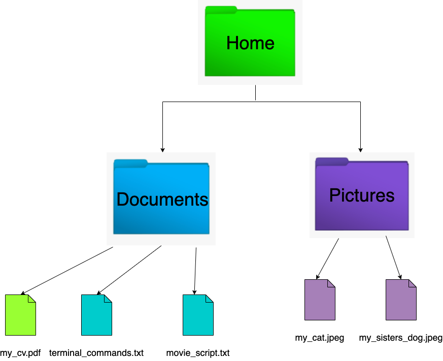
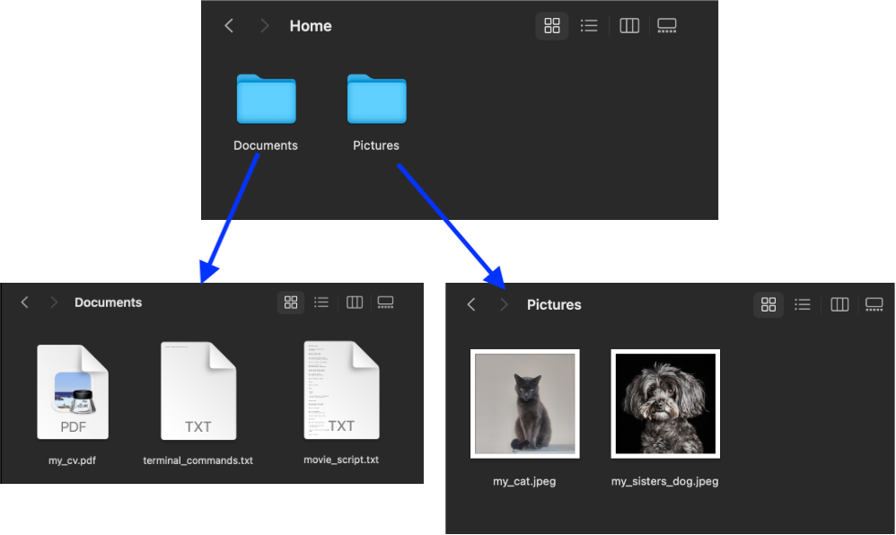
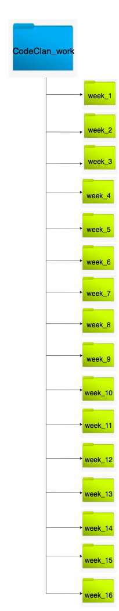

# Command Line Basics

**Lesson Duration: 60 minutes**

### Learning Objectives

- Know what `.`, `..` and `~` are shortcuts for
- Understand why using the command line is popular among developers
- Be able to navigate the macOS file system using Terminal
- Be able to create, rename/move or delete files and directories using Terminal

## Introduction

When most people use a computer, they interact with it via the graphical user interface (GUI) that is provided by their operating system. This typically involves using a mouse, or other pointing device, to click on icons on the screen.

Modern GUIs are great because they're very intuitive, but there is, however, another way that we can use a computer which gives us much greater control over everything that we do; using the command line. The command line is a text based interface that allows us to interact with the operating system using text commands. Any task that can be performed using the GUI can also be performed using the command line. There are also a lot of tasks that can _only_ be performed using the command line.

Once you're comfortable with it, the command line can be a much more efficient way to use a computer. There are also a lot of software development tools that are only available via the command line, so we'll need to learn it in order to be able to use those.

In this lesson we will learn some of the basic commands that will allow us to interact with our computer's file system via the command line. We will do this by using Terminal to create the directory structure that will contain all of our work throughout the course. This will provide a solid base of knowledge for us to build on top of as we progress through the course.

## The File System

Before we learn the commands that will allow us to interact with our file system, let's make sure that we're comfortable with what the file system is. The file system is how a computer stores information. It's usually represented as a series of files and folders (or directories). Directories are essentially just containers that are used for grouping and organising files in a way that makes sense to us. The file system can be represented visually as a branching tree-like structure.



This is what the same folder structure looks like in the finder in mac OS.



You've likely used macOS's Finder or Windows's File Explorer extensively to view, create, rename, move and delete files and directories in the past. Now we're going to learn how to do the same thing using Terminal, the macOS command line.

## Terminal

The first thing that we're going to need to do is open up Terminal. We can do this by using cmd + space to open up macOS's Spotlight Search, typing "Terminal" and press enter.

The first thing you'll notice when Terminal opens is probably the `~` symbol. `~` is the shortcut for our home directory, the top of our file system tree. This is our current location within the file system.

Now that we know where we are, let's start learning some commands. The first command that we will use is `ls`. `ls` can be used to list all of the files and directories in the current location. Enter the command `ls` and press the enter/return key to input the command.

```sh
ls

# This should show a list of all of the files and directories in your home directory, which is our current location within the file system.
```

### Flags

When using the various commands that are available in Terminal we can pass flags to them to provide additional information about how we want the command to work. When using the `ls` command, for example, we can use the `-l` flag. `-l` specifies that we would like the information back in long form.

```bash
ls -l

# This should show the same list of files and directories as before, but including additional information for each entry, such as file size, the user who owns the file and the time and date that the file was last modified.
```

We can also use the `-a` flag to specify that we want to see all of the files and directories in our current location, including hidden ones.

```bash
ls -a

# This should show a longer list including some hidden files and directories, denoted by a . before their name.
```

We can combine both of these flags to see all files and directories in long form.

```bash
ls -al
```

If you ever want to know which flags can be used with a command, you can use the `man` command to see the manual for that command.

```bash
man ls

# This should provide information about the ls command and all of the flags that can be used in combination with it.
```

## Creating Files and Deleting Files & Directories

Next, we'll learn how to create files and directories. We know that we're currently in the home directory, `~`. This is where we're going to create the directories for our CodeClan course work.

The command that we use to create a directory is `mkdir`. We will use the `mkdir` to create a directory called "codeclan work".

```sh
mkdir codeclan work
```

If we use the `ls` command to check if this has worked, we'll notice that this has not had the effect that we wanted it to!

```sh
ls
```

Unfortunately for us, the `mkdir` command is designed so that it can be used to create multiple directories at once. Instead of creating a directory called "codeclan work", `mkdir` has created two directories, one called "codeclan" and another called "work". When using `mkdir`, we can use a list of directory names, separated by spaces. When you want to create a directory with a name longer than a single word, it's better to use a separator other than space, `_` or `-` being the most commonly used characters.

Let's delete the two directories that we created and create one directory called "codeclan_work" instead. We can use the `rm` command to delete files or directories. When using the `rm` command to delete a directory, we must use the `-r` flag to specify that we also want to _recursively_ delete all of the files and directories within in.

```sh
rm -r codeclan work
```

Now that we've cleaned up the mess that we made, let's create the directory that we actually wanted - `codeclan_work`.

```sh
mkdir codeclan_work
```

Now, if we use the `ls` command to check that this has worked effectively, we should have a single directory called "codeclan_work".

```sh
ls
```

Next, we will move into the `codeclan_work` directory and create a directory for each week of the course. When we're done, we should be left with a directory structure that resembles the following:



When creating the week folders, we must specify that we need these directories to be _inside of_ the codeclan_work directory. We could do this by appending `codeclan_work/` to the start of the names of the directories.

```sh
mkdir codeclan_work/week_01
```

If we use the `ls` command now, we'll see that the `week_01` directory has not been created inside of `~`.

```sh
ls
```

Instead, it has been created inside of `codeclan_work`.

```sh
ls codeclan_work

# This will list the files and directories inside of the codeclan_work directory. We should see that week_01 has been created inside of codeclan_work
```

Prepending `codeclan_work/` to the beginning of the directory name works, but it will introduce a bit of extra typing. This will only get worse when we start working with more complex directory structures. Thankfully, there is an easier way to do this. We can change our current location within the file system and use that as the point of reference, instead of `~` (our home directory).

We can change our current directory using the `cd` command. We want to move from our current directory, `~`, to `codeclan_work`.

```sh
cd codeclan_work
```

> Note that the `~` denoting our current directory has changed to `codeclan_work`.

If we use the `ls` command here, we don't see the files and directories in `~` any more, we only see the files and directories inside of `codeclan_work`.

```sh
ls
```

If we wanted to move back up to `~`, we could the shorthand `..` which refers to the parent of the current directory.

```sh
cd ..
ls
cd codeclan_work

# cd .. should move us back to ~
# ls should list the files and directories in ~, demonstrating that we have moved back to ~
# We can then use cd to move back to codeclan_work
```

Next, we will move from `codeclan_work` into `week_01`, then we will create a `day_1` directory inside of `week_01`.

```sh
cd week_01
mkdir day_1
```

Now that we're in `day_1`, let's create a file. The command used to create files is `touch`. We're going to create a cheatsheet containing all of the Terminal commands that we have learned today and what they do. When creating a file, it's important to specify the file extension based on the type of file that you want to create. This will be a text file containing text, so we will use the .txt extension.

```sh
touch terminal_cheatsheet.txt
```

Now that we have created this file, let's open it up and add some content to it. We can use the `code` command to open files or all of the files in a directory with VS Code. Like `..`, shorthand for the parent of our current directory, we can use the shorthand `.` to refer to the current directory.

```sh
code .

# This will open all of the files in our current directory with VS Code
```

### Task - 10 minutes

In pairs, try to remember as many commands that we have learned today as possible. Type them along with a brief description of what they do into terminal_cheatsheet.txt.

## Renaming and Moving Files & Directories

The last thing that we're going to learn in this lesson is how to rename or move files and directories. We might create a lot of files over the course of a day at CodeClan and we want to keep them neatly organised, so let's move our cheatsheet into a new directory called "command_line_basics".

The first thing that we will have to do is create the new directory.

```sh
mkdir command_line_basics
```

Now that we have our new directory, we want to take the file terminal_cheatsheet.txt and move it from its current location into the `command_line_basics` directory. We can do this using the `mv` command.

The `mv` file requires two pieces of information.

1. Where are we moving the file from?
2. Where are we moving the file to?

This information should be layed out in the following format.

```sh
mv [old location] [new location]
```

In order to move terminal_cheatsheet.txt from its current location to `command_line_basics`, we can use the following command.

```sh
mv terminal_cheatsheet.txt command_line_basics/terminal_cheatsheet.txt
```

We can also use the `mv` command to rename files without moving them. We can do this using the following format.

```sh
mv [old filename] [new filename]
```

Suppose we had make a mistake when naming terminal_cheatsheet.txt, we could fix it as follows.

```sh
mv treminl_chaetsheet.txt terminal_cheatsheet.txt
```

## Recap

What are `~`, `.` and `..` shortcuts for?

<details>
<summary>Answer</summary>
Home
Current directory
Parent directory
</details>

Why is the command line popular among developers?

<details>
<summary>Answer</summary>
The command line can be used to complete common tasks a lot more efficiently than the GUI. It is also required to use a lot of developer tools which do not have GUIs.
</details>

Which command can be used to change directory?

<details>
<summary>Answer</summary>

`cd`
</details>

Which command can be used to create a directory?

<details>
<summary>Answer</summary>

`mkdir`
</details>

Which command can be used to create a file?

<details>
<summary>Answer</summary>

`touch`
</details>

Which command can be used to delete a file or directory?

<details>
<summary>Answer</summary>

`rm`
</details>

### Mini-lab:
Let's practice making some folders and files.

- In your day_1 folder, make a folder called `command_line_practice`
- Inside that a folder called `my_home`
- Inside the `my_home` folder make a folder for every room in your house
- In the `my_home` folder make a `.txt` file for each person or pet that lives in your house
- Now imagine one of them got a phd, congratulations!, please rename the household member to include their new title of Doctor

## Conclusion

Now that we know how to navigate the file system and perform some basic tasks in Terminal, macOS's command line, we will be able to set up our Python projects much more efficiently. This will also make it a lot easier for us to learn how to complete some more advanced tasks and use some command-line interface (CLI) developer tools a bit later on.
