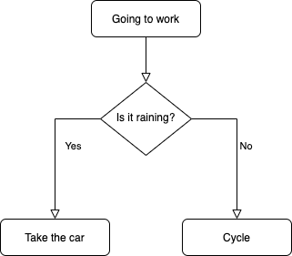
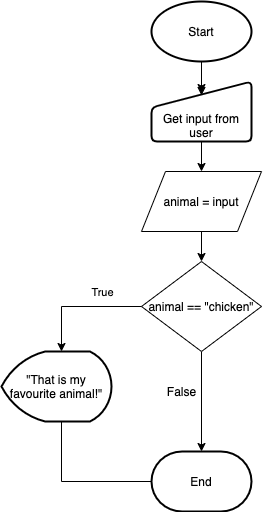
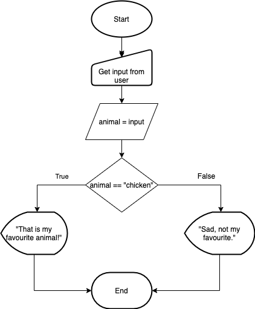
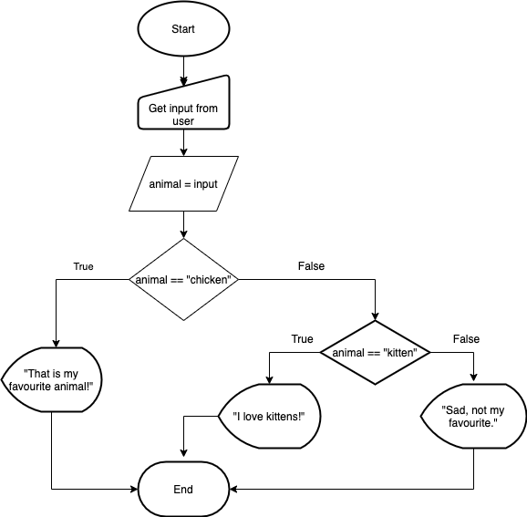

# Conditional Logic

**Lesson Duration: 60 minutes**

### Learning Objectives

- Understand what conditional logic is
- Understand why we use conditional logic in our code
- Understand how to check for equality
- Be able to use conditional operators
  - `==` (is equal to)
  - `<` (is less than)
  - `>` (is greater than)
  - `>=` (is greater than or equal to)
  - `<=` (is less than or equal to)
- Be able to use an `if` statement
- Be able to use an `else` clause in an `if` statement
- Be able to use an `elif` clause in an `if` statement
- Be able to check multiple conditions using `and` and `or`

## Intro

Every day we make decisions which effect what we do. If we didn't then we'd do exactly the same thing every day, and in every situation, and life would get really repetitive.

Often, these decisions we make in our daily lives are made based on a 'yes' or 'no' question. When we think about these questions and come to a yes / no answer we are evaluating them. We take in a statement about the world and then give a yes / no answer. We then make a decision as to what to do based on that answer.

> Ask students to think of a question that has a yes no answer, e.g. "Am I hungry?" "Is it raining today?"

Computer programs work in exactly the same way. We can give them a "statement" just like what we have been doing, and it will "evaluate" it to true or false (yes or no). Our programs can then take different paths depending on the condition - this is why such statements are called _conditional statements_. If we could not do this, then all our programs would behave in exactly the same way, every time we run them.

We can try to convert question statements to boolean expressions. (true or false statements) Open-ended questions cannot be converted to booleans, we need to be making a yes or no decision.

> Maybe ask the class how, if possible, to convert the following to boolean expressions

```
1) Are you aged over 18?
2) Where were you born?
3) Is it sunny today?
4) Have you been to Rome?
5) Is the number 7 an even number?
6) What is your favourite colour?
```

```
1) I am aged over 18
2) Can't make it boolean
3) It is sunny today
4) I have been to Rome
7) 7 is an even number
6) Can't make boolean
```

## Checking for Equality

One form of conditional statement in programming is to check if two values are the same. If they are the same, the result is true, otherwise it is false.

In Python we use a special operator to check if things are equal. We cannot use the `=` operator for this - if you remember, `=` on its own *assigns* a variable. Two `==` together checks if two things are equal.

Examples of statements that evaluate to true or false:

```bash
# terminal
python3
```

```python
4 == 2 + 2
# => True

4 == 2 + 3
# => False

"cat" == "cat"
# => True

"cat" == "dog"
# => False
```

Note that Python requires both the type _and_ value to be the same for two things to be considered equal.

```python
"1" == 1
# => False
```

How do we fix this?

```python
"1" == str(1)
int("1") == 1
```

## Conditional Operators

The equality or `==` operator belongs to a group of operators which are used for checking conditions. These are collectively known as conditional operators.

### `>` - Is Greater Than

We use this operator to evaluate if the object on the left is greater than the object on the right.

```python
5 > 4
# => True
9 > 100
# => False
```

### `<` - Is Less Than

We use this operator to evaluate if the object on the left is less than the object on the right.

```python
99 < 100000
# => True

100 < 50
# => False
```

### `>=` and `<=`

These two operators, "greater than or equal to" (`>=`) and "less than or equal to" (`<=`) are variants of the greater than and less than operators, which also evaluate to `true` if the values are equal, unlike the greater than and less than operators themselves.

```python
100 < 100
# => False

100 <= 100
# => True

99 <= 100
# => True
```

# Control Flow

Similarly, we might make decisions based on whether something is true or false.

> Ask students to think of examples where something happens in your daily life based on the outcome of one of these yes/no statements.

> Perhaps draw flowcharts for a couple

If it's raining, I'll take the car to work. Otherwise, I'll cycle.



If I catch a Pikachu I'll be happy, otherwise I'll be sad.

Programming languages also do this to allow us to have different actions and paths our code can go down, otherwise our program could only do one thing. This ability to control the flow of a program based on changing conditions is one of the most important, and most powerful features of programming languages.

## `if` Statement

We are going to write a small program which asks the user to enter which animal they are and the program will display a response depending on what the user enters.



```bash
# terminal
touch what_animal.py

code .
```

## Pseudocode

Pseudocode is English-like language intended for human reading rather than machine reading.
When we're solving a problem, often it helps us organise the steps involved by writing them out in a non-code language.

Here's an example for our what animal program:

```python
# what_animal.py

# SET animal = INPUT "What animal are you? "
# IF animal is "chicken"
#    THEN PRINT "This is my favourite animal!"
# END

```

So let's get the user to enter which animal they are.

```python
# what_animal.py

animal = input("What animal are you? ")
```

We are now going to check the value of `animal` and if it is "chicken" we want the program to print out the message "This is my favourite animal!".

To do this we are going to use an `if` statement, which is the simplest form of Python control flow statement.

To create an `if` statement in Python we begin by writing the `if` keyword. This is followed by the condition, the statement we want to evaluate to true or false, followed by a colon (`:`);

On the next line(s) we write the code we want to execute if the condition is true. This code is indented so that we can distinguish this code from the rest of the code in the program.

```python
# what_animal.py

animal = input("What animal are you? ")

if animal == "chicken":
    print("This is my favourite animal!")
```

### A Note on Code Blocks and Indentation

Note that we indent the code as we take actions depending on the outcome of the `if`.

Python relies on indentation (whitespace at the beginning of a line) to define lines of code which are grouped together. Other programming languages often use curly-brackets for this purpose. To indicate a block of code in Python, you must indent(add whitespace to the start of the line) each line of the block by the same amount. The two blocks of code in our example `if` statement are both indented by four spaces, which is a typical amount of indentation for Python.

## The `else` Clause

So our program now does something if our condition is true, but we might want to do something different if our condition is false. It's like saying:

```
IF the condition is true THEN do X
OTHERWISE do Y
```
In Python, rather than saying 'otherwise' we use the `else` keyword. The code inside the `else` section will be run if the `if` condition is `false`.

So in our program, if the user input is not "chicken" then we are going to get the program to display "Sad, not my favourite."



To add an `else` section we add an _unindented_ line with the `else` keyword followed by a colon (`:`). On the next line(s) we write the code we want to execute for the 'else' section. Like the code in the `if` section, this code is indented.

Let's add to our pseudocode.

```python
# what_animal.py

# SET animal = INPUT "What animal are you? "
# IF animal is "chicken"
#    THEN PRINT "This is my favourite animal!"
# ELSE
#    PRINT "Sad, not my favourite." 
# END
```

```python
# what_animal.py

animal = input("What animal are you? ")

if animal == "chicken":
    print("This is my favourite animal!")
else:
    print("Sad, not my favourite.")
```

## Adding Other Conditions

At the moment we only check the input for one value, "chicken", but what if we want to print out a different message if the user enters "kitten"? 



One way to do it would be to add another `if` statement to the code in the `else` section:

> Show this but don't get students to code along

Let's add to our pseudocode.

```python
# what_animal.py

# SET animal = INPUT "What animal are you? "
# IF animal is "chicken"
#    THEN PRINT "This is my favourite animal!"
# ELSE
#    IF animal is "kitten"
#        THEN PRINT "I love kittens!"
#    ELSE
#        PRINT "Sad, not my favourite."
# END
```

```python
# what_animal.py
animal = input("What animal are you? ")

if animal == "chicken":
    print("This is my favourite animal!")
else:
    if animal == "kitten":
        print("I love kittens!")
    else:
       print("Sad, not my favourite.")
```

This can get very messy, especially if we want to add further conditions but thankfully Python has another clause which we can add to an `if` statement - the `elif` (short for 'else if') clause. We add this after the `if` section, but _before_ the `else` section. Like `if`, `elif` is followed by the condition we want to check, then the code we want to run if the condition is true, so if we wanted to check that the user had entered `kitten` we could add an `elif` clause to our program:

Let's add to our pseudocode.

```python
# what_animal.py

# SET animal = INPUT "What animal are you? "
# IF animal is "chicken"
#     THEN PRINT "This is my favourite animal!"
# ELSE IF animal is "kitten"
#     THEN PRINT "I love kittens!"
# ELSE
#     PRINT "Sad, not my favourite."
# END
```

```python
# what_animal.py

animal = input("What animal are you? ")

if animal == "chicken":
    print("This is my favourite animal!")
elif animal == "kitten": # ADDED
    print("I love kittens!")
else:
    print("Sad, not my favourite.")
```

We can add as many `elif` clauses as we need, as long as they are added before the `else` clause.

Let's make a little program that asks you to guess when Python was created.

> Give students a few minutes to try this. Give them a hint that the correct answer should be 1991!

```python
guess = input("When was Python created? ")

if int(guess) == 1991:
    print("Whoo you win!")
else:
    print("Nope")
```

## Control Flow Nice to Haves

### The Ternary Operator

If you have an `if...else` statement where you have only one statement to execute for `if` and only on statement to execute for `else` e.g

```python
score = 6

if score > 5:
    result = "pass"
else:
    result = "fail"

print(result)
```

We can put the statement all on the same line

```python
score = 6

result = "pass" if score > 5 else "fail"

print(result)
```

## Checking Multiple Conditions

Sometimes we want to check if one or more conditons are true. To do this we can use __logical__ operators.

```bash
#terminal
touch logical_operators.py
```

```
#logical_operators.py

jarrod_hungry = True
jarrod_tired = True
```

### `and`

Let's say we want to compare _both_ `jarrod_hungry` _and_ `jarrod_tired`. If they are _both_ `true` then we want to print the message "Jarrod is hangry!". We can attach more than one condition to the same `if` statement using the `and` operator. For the `and` operator to return `true` _both_ conditions need to evaluate to `true`

```python
#logical_operators.py

jarrod_hungry = True
jarrod_tired = True

if jarrod_hungry and jarrod_tired:  # ADDED
    print("Jarrod is hangry!")
```


### `or`

So rather than printing "Jarrod is hangry!" if both `jarrod_hungry` and `jarrod_tired` are true, let's say we want to print "Jarrod is grumpy!" if either `jarrod_hungry` is `true` OR `jarrod_tired` is `true` OR both `jarrod_hungry` and `jarrod_tired` are `true`. Rather than using the `and` operator, we can use the `or` operator:

```python
#more_conditionals.py

jarrod_hungry = True
jarrod_tired = True

if jarrod_hungry and jarrod_tired:
    print("Jarrod is hangry!")

jarrod_tired = False # ADDED
if jarrod_hungry or jarrod_tired:
    print("Jarrod is grumpy!")
```

## Recap

What is conditional logic?
<details>
<summary>Answer</summary>
Conditional logic is making a decision based on whether a condition is true or false
</details>

Which operator do we use to check for equality?
<details>
<summary>Answer</summary>
`==` is the equality operator. `=` is used to assign a value.
</details>

What are the other conditional operators?

<details>
<summary>Answer</summary>

- `>` - is greater than
- `<` - is less than
- `>=` - is greater than, or equal to
- `<=` - is less than, or equal to
</details>

Which type of statement can we use to add to control flow in our programs?
<details>
<summary>Answer</summary>
`if` statement
</details>

Which type of clauses can add to an alternative to an `if` statement?
<details>
<summary>Answer</summary>
`elif` clause
`else` clause
</details>

When does the `and` logical operator do?
<details>
<summary>Answer</summary>
The logical `and` operator returns `true` only if eboth conditions evaluate to `true`
</details>

When does the `or` logical operator do?
<details>
<summary>Answer</summary>
The logical `or` operator returns `true` if either or both conditions evaluate to `true`
</details>

## Conclusion

We have seen that in our programs we can create expressions that evaluate to `true` or `false`. We have seen that we can use these expressions in `if` statements to control the flow our programs. 
