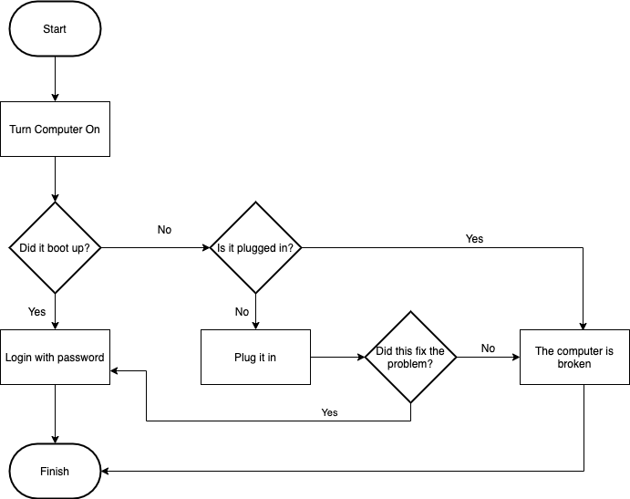

# Control Flow/Conditionals Lab

**Lab Duration: 30 minutes**

## Learning Objectives
- Practice translating a flowchart into code
- Practice pseudocode
- Practice conditional logic

Write a Python program based on the following flowchart. 



### Getting Started

1. Create a new file called ``` computer_troubleshooting.py ```
2. Write pseudocode based on the flowchart
3. Translate the pseudocode into working Python code