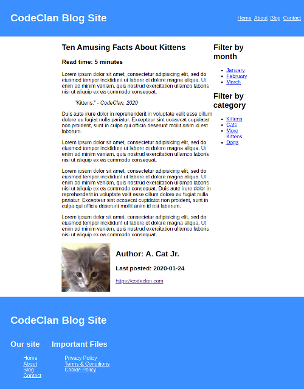
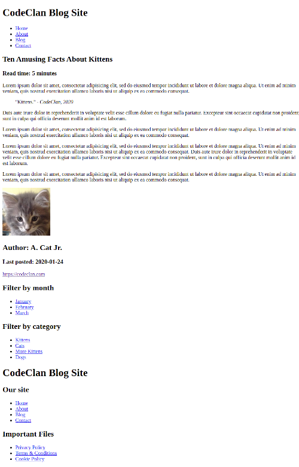
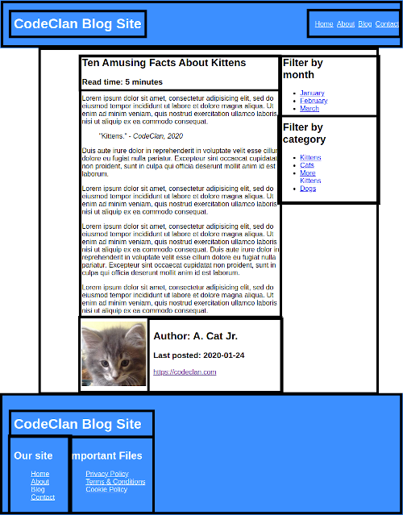

# Semantic HTML5

**Duration: 60-90 minutes**

### Learning Objectives

- Know what semantic HTML5 is and how to write it.
- Know what classes and ids are, and when each should be used.
- Know how to navigate the MDN HTML docs.

## Introduction

HTML5 is the currently used version of HTML, which stands for *Hypertext Markup Language*. HTML is the code which browsers use to render the content of a web page. MDN describes HTML as:

> "...a series of elements which you use to enclose, wrap, or *mark up* different parts of the content to make it appear or act a certain way."

Almost every web page you've ever visited will have been made up with HTML. In this lesson we will be learning how to write HTML5 in the way it was intended to be written, known as *"semantic HTML5"*.

This will allow us to create well built web pages for our web apps. Today we will be creating a very simple web page to test and explore some of the most commonly used features of HTML.

## Lesson Content

### HTML Elements

As you know, when we work with HTML, we wrap our content in a series of "elements". Elements take the form of opening and closing tags, with the wrapped content between them. There are many types of HTML elements available for us to use, and each has a different use case:
- `<ol>` or `<ul>` and `<li>` for ordered or undordered lists with list items.
- `<h1>` through `<h6>` for headings.
- `<p>` for paragraphs.

For a full list of elements available in HTMl5 visit the [MDN HTML5 Docs](https://www.wpkube.com/html5-cheat-sheet/).

### Use and Misuse

When building an HTML page, it can quickly take on a complex structure and become full of many elements. Due to this the code for the page can become quite hard to read. One way in which we can mitigate that unreadability, as well as increase the accessibility for our web pages, is by using the appropriate tags in the right places.

Far too often do people overuse the infamous `<div></div>` tag when writing their content into a web page. When the `<div>` tag is misused in this way it can quick make our code this barely intelligible mess of the same tag wrapping the same tag wrapping the same tag.

The `<div>` tag does have actual uses. The tag exists not to wrap and lay out **content**, but rather to allow us to build more complex **aesthetic** layouts - allowing us to group various elements or sections of our page without implying anything about the content in the group. It's wrongly more often used to group **content**, which is ironically the exact opposite of its intended use.

HTML5 offers us many alternatives to this `<div>` tag for the purposes of grouping and describing content - many of which we will be exploring throughout the construction of our web page.

### The Basic Skeleton

When we start writing an HTML document, we usually start with a standard skeleton:

```HTML
<!DOCTYPE html>
<html lang="en">
<head>
  <meta charset="UTF-8">
  <meta name="viewport" content="width=device-width, initial-scale=1.0">
  <title>Name of page</title>
</head>
<body>

</body>
</html>
```

This will do a few things for us:

- `<!DOCTYPE html>` will tell our browser that this is an HTML document, and should be treated as such.
- `<html lang="en">` will tell the browser that whatever is inside it is the main HTML in the document.
- `<head>` tells the browser that whatever is inside it isn't to be rendered and exists for non-visual reasons.
- `<meta>` will describe our page to the browser and search engines, dictating some of the behaviours of the page or providing information.
- `<title>` will tell the browser and search engines the name of the page:
  - Search engines will display this name on their results pages.
  - The browser will put this name in the tab at the top of the browser.
- `<body>` will tell the browser that whatever is inside it is to be rendered in the browser and shown to the user.

This skeleton is standard, and most text editors will offer a snippet to generate it for you. In VS Code, we can type `HTML` and select the HTML:5 option to autocomplete this skeleton.

### A Basic Layout

For the page we are going to build in this lesson - we will be using a simplified version of a commonly used layout that you may have seen before.



You may wish to refer back to this design as we progress through the lesson.

HTML only dictates the content that is displayed on a web page and its structure, so our page won't look identical to this, but the above screenshot was created from the HTML that we will write in this lesson without modication.

The finished HTML will appear as follows.



### Getting Started

We'll start by creating a file called "index.html", by convention this is the name of the HTML file for the main page of a website. We'll go through our wireframe from top to bottom, left to right: and thus will start with the header.

```sh
touch index.html
```

Open the file up with a text editor and let's get started...

When creating the HTML structure for a page, it can be difficult to know where to start. Taking the design that you want to achieve and breaking it into boxes can make this process much easier. Then start at the top of the design and work your way from top to bottom and left to right.



We will work through the page in the following order:

- header
  - logo
  - nav links
- main content
  - main article
    - headings
    - main content
    - footnote - author
  - filter navigation
    - filter by month
    - filter by category
- footer

If you feel like you couldn't have come to this conclusion on your own, don't worry! The ability to quickly break down a design into an HTML structure that makes sense will come with time and practice.

First, we will need to insert the standard HTML boilerplate that we saw earlier. Fortunately, most text editors offer this as a snippet, so we don't have to type it out manually every time.

In VS Code, you can simply type `html` and select the `html:5` autocomplete option.

```html
<!-- index.html -->

<!DOCTYPE html>
<html lang="en">
<head>
  <meta charset="UTF-8">
  <meta name="viewport" content="width=device-width, initial-scale=1.0">
  <title>Document</title>
</head>
<body>
  
</body>
</html>
```

This boilerplate code is fairly standard and requires minimal changes for each new project. The only thing that we will change is the `<title>`, so that something more appropriate is displayed in the tab bar in the browser. Let's change the `<title>` to "CodeClan Blog Site".

```html
<title>CodeClan Blog Site</title> <!-- UPDATED -->
```

Great, now we're ready to move on and start building the actual content of the webpage. As we outlined earlier, the top level elements of our page will be the header, main content - which will include the main article and filter nav links, and the footer. Let's block those out.

```html
<body>
  <header>
    <!-- Our header content will go here -->
  </header>
  <main>
    <!-- Our main content will go here -->
  </main>
  <footer>
    <!-- Our footer content will go here -->
  </footer>
</body>
```

`<header>` will contain the blue header at the top of the page
`<main>` will include the white content in the middle of the page
`<footer>` will contain the blue footer at the bottom of the page

### The Header

The header tag implies that the content inside it is in some way a higher level section of content which will render above the main (`<main>`) part of a group of related contents. This group of related pieces of content can constiture an entire HTML document, a blog post, a news article, or even a form. In our case our `<header>` is heading up the entire page. It will contain a title for the site, as well as some navigational links for moving around between pages on our site. We won't be creating any other pages today though, they're just for show.

The `<header>` will have two child elements - the site logo and the navigational links. We won't be using any `<div>` elements here because there are more appropriate tags that better describe the content.

We can consider the site logo to be the top level header on the page, so we will use an `<h1>` tag for this and a `<nav>` tag to contain the list of navigational links.

```html
<header>
  <h1>CodeClan Blog site</h1> <!-- NEW -->
  <nav>                       <!-- NEW -->

  </nav>                      <!-- NEW -->
</header>
```

## Navigational Links

Now that we've got our side details in the header, we'll move on to our navigational links. Generally speaking, when we create a list of navigational links in the header (yes, a "navbar" is technically still a list of links), we use a `<ul>`, inside a `<nav>`. This tells anyone else reading our code, and also our browser - that this is a list of links, which are going to be used for navigation.

```html
<nav>
  <ul>
    <!-- Our links will go here -->
  </ul>
</nav>
```

This structure makes things highly readable to anyone with the most basic of understandings of HTML.
Something which many people forget to do when creating a structure like this, is that because we are using a `<ul>`, we must wrap our links in `<li>` elements.

```html
<nav>
  <ul>
    <li>
      <a href="/home">Home</a>
    </li>
    <li>
      <a href="/about">About</a>
    </li>
    <li>
      <a href="/blog">Blog</a>
    </li>
    <li>
      <a href="/contact">Contact</a>
    </li>
  </ul>
</nav>
```
> NOTE: For now we will leave the `href` HTML attribute as these placeholder values, as we don't actually have any other pages to navigate to.

Our header is complete, we have our site logo and a small navigational menu. It definitely doesn't look the best at the moment, but don't fret - CSS will take care of this later.

### HTML Attributes

We just added an `href` attribute to our `<a>` elements. This tells the browser where we want the user to be navigated to when they click on our link.

HTML attributes are like annotations that we can put on our HTML opening tags in order to describe them in a little more context that their element name provides. There are many different HTML attributes available to us, and there are different ones for different elements.

If you're interested in what attributes are available for different HTML elements, the MDN docs for different elements will provide them for you.

## The Main Content

We have a header, so now it's time to flesh our page out with something a bit more substantial. Let's have a look at adding the main part of our blog page: the blog post. In our case, the main part of our content consists of the blog post itself, and the sidemenu adjacent to it. We will communicate that this is the main part of our content by using the `<main>` tag to wrap all this content.

We will also be using an `<article>` tag and an `<aside>` tag to wrap our blog post, and our sidemenu, respectively.

```html
    <main>
      <article>
        <!-- Our blog post will go here -->
      </article>
      <aside>
        <!-- Our side menu will go here -->
      </aside>
    </main>
```

An article tag groups related content of a **single, self-contained context, which could be independently reusable or redistributable**. A blog post would definitely match this description.

The reason you may not necessarily jump to an `<article>` tag every time you have some pieces of content which are related to each other is that sometimes the content isn't **self-contained**.

## Our Blog Post

Now that we've outlined a place for our blog post, we can start looking at its internal structure. The temptation is to go simple: maybe an `<h2>`, a few `<p>` tags, not much more... however there is more we can do here to properly structure our content here.

Our blog post is not only going to have a title, but a subtitle for the date and read time as well: thus will require two heading tags; it will have the main content of the post; and it will also have an area at the bottom for the author.

This is starting to sound familiar... a piece of content containing a three part structure: one acting as an introduction, one as a main container for the bulk of the content, and another to round things off at the end. Here we see another place we can use our `<header>`, `<main>`, and `<footer>`. Due to their containment inside the `<article>` elements, these three elements will act as parts of the blog post, while the **same elements** elsewhere act as parts of the page as a whole: it's all about **context**.


```html
<!-- index.html -->
<!-- ... -->
<article>
  <header>
    <!-- Our headings will go here -->
  </header>
  <main>
    <!-- Our blog post will go here -->
  </main>
  <footer>
    <!-- Our author details will go here -->
  </footer>
</article>
<!-- ... -->
```

Once again we will progress top to bottom: so let's have a look at the `<header>` element. It will have two headings in it.


We already have an `<h1>` on the page, so we will need to think about the 'heading hierarchy' to keep things semantic. We will use an `<h2>` for the blog post title as it follows the page's `<h1>` in terms of scope; and we will use an `<h3>` for the read time subtitle, as it acts as a subtitle for an `<h2>`. Further than that, we want to very clearly communicate that the combination of our `<h2>` and `<h3>` constitute **one** overall heading for a piece of content, and thus will wrap them in `<header>` elements.

```html
<header>

  <h2>Ten Amusing Facts About Kittens</h2>
  <h3>Read time: 5 minutes</h3>
</header>
```

With our brief intro complete for our blog post it's time to move onto the main content: the post. Depending on the content of the post here, this could be incredibly simple, or incredibly complex. Let's aim for somewhere on the simple end.

A `<blockquote>` is used to highlight a particular part of a piece of content, usually a relative direct quote. When it's being used for a direct quote, we use a `<cite>` tag to credit the quote personally, and we also use a `cite="source"` attribute on the blockquote to credit the source of the quote.

Of course we can't deglect the mighty `<p>` element, we will use one of these elements **for each** paragraph in the content of our post.

> Feel free to cut & paste, rather than type this one out

```html
<main>
  <p>
    Lorem ipsum dolor sit amet, consectetur adipisicing elit, sed do eiusmod tempor incididunt ut labore et dolore
    magna aliqua. Ut enim ad minim veniam, quis nostrud exercitation ullamco laboris nisi ut aliquip ex ea commodo
    consequat.
  </p>
  <blockquote cite="https://codeclan.com/">
    "Kittens." - <cite>CodeClan, 2020</cite>
  </blockquote>
  <p>
    Duis aute irure dolor in reprehenderit in voluptate velit esse cillum dolore eu fugiat nulla pariatur.
    Excepteur sint occaecat cupidatat non proident, sunt in culpa qui officia deserunt mollit anim id est laborum.
  </p>
  <p>
    Lorem ipsum dolor sit amet, consectetur adipisicing elit, sed do eiusmod tempor incididunt ut labore et dolore
    magna aliqua. Ut enim ad minim veniam, quis nostrud exercitation ullamco laboris nisi ut aliquip ex ea commodo
    consequat.
  </p>
  <p>
    Lorem ipsum dolor sit amet, consectetur adipisicing elit, sed do eiusmod tempor incididunt ut labore et dolore
    magna aliqua. Ut enim ad minim veniam, quis nostrud exercitation ullamco laboris nisi ut aliquip ex ea commodo
    consequat.
    Duis aute irure dolor in reprehenderit in voluptate velit esse cillum dolore eu fugiat nulla pariatur.
    Excepteur sint occaecat cupidatat non proident, sunt in culpa qui officia deserunt mollit anim id est laborum.
  </p>
  <p>
    Lorem ipsum dolor sit amet, consectetur adipisicing elit, sed do eiusmod tempor incididunt ut labore et dolore
    magna aliqua. Ut enim ad minim veniam, quis nostrud exercitation ullamco laboris nisi ut aliquip ex ea commodo
    consequat.
  </p>
</main>
```

This will be enough content for the main content of our post for now.

Finally let's finish off this blog post and fill in our author profile section:

We used a `<footer>` here as it's a footnote to the article. This footer will have three child elements, the image of the author and the two heading elements.

These headings are at the same level as headings of the `<main>` article above, so we will use `<h2>` and `<h3>` tags for the heading and subheading respectively.

Also, it seems we have found a use case for a `<div>` tag. Here we need to wrap the `<h2>`, `<h3>` and `<a>` in a single box purely for formatting reasons, as we want these tags to appear together beside the `` and not not below it, which is the default in HTML.

```html
<footer>
  
  <div>
    <h2>Author: A. Cat Jr.</h2>
    <h3>Last posted: 2020-01-24</h3>
    <a href="https://codeclan.com/" target="_blank">https://codeclan.com</a>
  </div>
</footer>
```

You'll notice we added a the HTML attribute `target="_blank"` to our `<a>` element, this is because we want the destination of the link to open in a new tab when clicked - meaning the user won't be navigated off of our blog site.

Just like that, the main part of our content is complete and properly structure. Just two more sections to go.

## The Side Menu

We've got our header for the major navigation around pages and our article area to show off out blog post; so how about a side-menu for navigation within the blog section of our site.

For this we will use an `<aside>` tag: they contain content which **indirectly** related to the context which the main content relates to. In our case the menu will sit to the right of the article (once it's been CSS'd) and is indirectly related to our blog post because it relates to all the blog posts as a whole!

These `<aside>` elements aren't always for menus though, they can also be used for extra content which will side next to some of the main stuff - such as quotes.

We will start, as always, with the basic structure for what we want. We will use `<section>` tags to wrap each of the filter lists.

```html
<aside>
  <section>
  </section>
  <section>
  </section>
</aside>
```

> Ask the students which HTML elements we will use to structure these. We have seen them before: if needed give hints on *navigation*, and *heading hierarchy*.

```html
<aside>
  <section>
    <h2>Filter by Month</h2>
    <nav>
      <ul>
        <li><a href="/blog/month/january">January</a></li>
        <li><a href="/blog/month/february">February</a></li>
        <li><a href="/blog/month/march">March</a></li>
      </ul>
    </nav>
  </section>
  <section>
    <h2>Filter by Category</h2>
    <nav>
      <ul>
        <li><a href="/blog/kittens">Kittens</a></li>
        <li><a href="/blog/cats">Cats</a></li>
        <li><a href="/blog/morekittens">More Kittens</a></li>
        <li><a href="/blog/dogs">Dogs</a></li>
      </ul>
    </nav>
  </section>
</aside>
```

That's our side-menu done - it'll look a little weird as it is right now... not very **side** for a side-menu. Positioning the elements can be done later, using CSS.

A lot of people work on their HTML and CSS at the same time - this is a completely fine way to work through things. However it can be highly useful to focus purely on one, and then the other: as it will give you an idea of what your site will look like if for any reason the CSS fails to load. It can help you ensure that your site is still useable without any styling.

## The Footer

The last area of the page we want to work on is naturally the footer. Our footer will act as another overall summary of the site, and will also contain a list of important files or notices that must be accessible to the user. Ours will have another showing of the site logo, a list of pages available to be navigated to (sometimes called a sitemap), and a file list as mentioned.

Let's start by blocking out the basic structure of our `<footer>` content:

```html
<footer>
  <h1>CodeClan Blog Site</h1>
  <section>
    <!-- Our sitemap will go here -->
  </section>
  <section>
    <!-- Our important files will go here -->
  </section>
</footer>
```

Again, here we need to group these `<sections>` together purely for formatting reasons, i.e. display them side by side, so we will wrap a `<div>` element around them.

We will also add an `id` to this `<div>`, which will make it easier to access for styling later on.

```html
<footer>
  <h1>CodeClan Blog Site</h1>
  <div id="footer-container"> <!-- NEW -->
    <section>
    </section>
    <section>
    </section>
  </div>                      <!-- NEW -->
</footer>
```

We'll flesh out these sections in order, starting with the site map as it appears closest to the left.

```html
<section>
  <h2>Our Site</h2>
  <nav>
    <ul>
      <li><a href="/home">Home</a></li>
      <li><a href="/about">About</a></li>
      <li><a href="/blog">Blog</a></li>
      <li><a href="/contact">Contact</a></li>
    </ul>
  </nav>
</section>
```

The important files section will follow exactly the same pattern. We'll leave `href` attributes of the links blank to save ourselves a bit of typing. I'm sure you get the idea by now.

```html
<section>
  <h2>Important Files</h2>
  <nav>
    <ul>
      <li><a href="/">Privacy Policy</a></li>
      <li><a href="/">Terms & Conditions</a></li>
      <li><a href="/">Cookie Policy</a></li>
    </ul>
  </nav>
</section>
```

## Voila!

With that the HTML structure of our blog page is complete. It looks super basic at the moment: no colours, no layouts, not even a font. This is what users will see if they don't allow CSS, or if our CSS doesn't load for someone.

**Note:** A website/web-app which still functions as intended without the CSS (or JavaScript) is called a **Progressive Web App**.

Our page is semantically structured: the code is nice, easy to read, and expressive; and tools like screenreaders or search engines crawlers will find this structure very easy to read/preferable for your SEO ranking.

In the next few lessons we will work on making our web pages look and feel like the real deal: firstly with pure aesthetics, then with an added layout to ensure our content sits where we want it to.

## Recap

<details>
<summary>What is an HTML attribute?</summary>
Values that configure the elements or adjust their behavior in various ways to fit specific uses.
</details>

<details>
<summary>What is the purpose of the alt HTML attribute on an image tag?</summary>
The alt attribute serves two main purposes: to display and describe an image when the image fails to load; and to describe the image to screenreaders so that the visually impaired can know what is imaged.
</details>

<details>
<summary>What is a Progressive Web App?</summary>
A web app which still functions without its CSS and JavaScript.
</details>

<details>
<summary>What's the difference between a <code>&#60section&#62</code> element, and an <code>&#60article&#62</code> element?</summary>

An `<article>` tag groups related content of a **single, self-contained context, which could be independently reusable or redistributable**.

A `<section>` element is used to group pieces of related content - which appears to be a standalone section, which is not necessarily **self-contained or redistributable**, when no other *more specific/semantic* content grouping element like an `<article>`.
</details>

## Conclusion

In this lesson we learned how to use some of the most common HTML lessons in ways that would be considered semantically correct. When writing HTML, it's important to think about the context of the content within the page when deciding what type of elements to use to structure it. Next we will learn how to use CSS to style our web page and make it look a bit more presentable.

## Further Resources

- [MDN docs on HTML](https://developer.mozilla.org/en-US/docs/Web/HTML)
