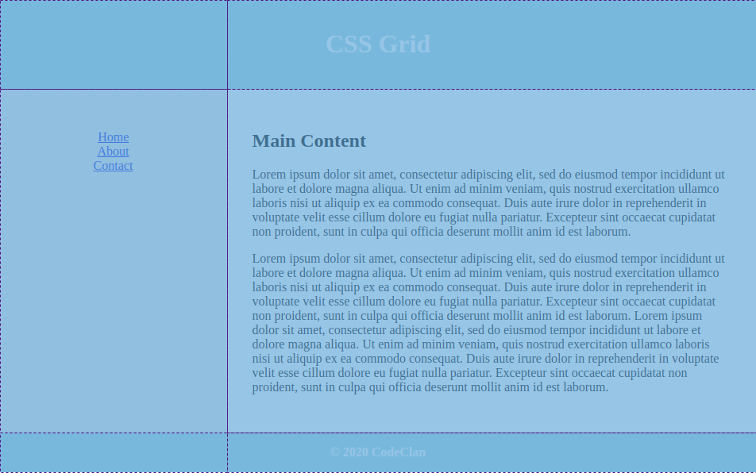

# CSS Grid Layout

__Lesson Duration: 30 minutes__

### Learning Objectives

- Understand the purpose of CSS Grid Layout
- Be able to use CSS Grid Layout to control the size and positioning of HTML elements

## Introduction

In this lesson we will learn how to use CSS Grid Layout to create the layout for a web page. CSS Grid Layout allows us to divide a page into sections and decide how they should be displayed in terms of size and position in relationship to each other.

One of the main strengths of CSS Grid Layout is that the order that these sections appear in our HTML is not important. We can move them around in relation to each other however we see fit. This means that it is relatively straightforward to create completely different layouts for desktop and mobile, if necessary.

Here is a preview of the layout that we will create in this lesson:


Open up the start code and take a few minutes to read over the code. Note the structure of the HTML. There is a `div` element with the id `grid-container`. We will use CSS Grid Layout to control the layout of all child elements on this `div`. Within the `grid-container` there are 4 child elements. These will form the sections of our page. They are:

- A `header`
- A `div` with the id `menu`
- A `section` with the id `main-content`
- A `footer`

## Our Layout

As you may have guessed based on the name, CSS Grid Layout works by dividing the sections of our page up into a grid.



Our web page will have 2 columns and 3 rows. Each section will occupy a single row. The `header` and `footer` will occupy both columns, while the navigation menu and main content section will occupy one column each.

## Creating a Layout

As with Flexbox, CSS Grid Layout provides us with a set of properties that can be applied to both the parent container element and the child elements within. In order to use CSS Grid Layout, we must mark the parent container as a `grid` container and we must mark each of the child elements as `grid-element`s and specify a variable name to refer to them by in our grid template.

The first thing that we will do is mark set the `display` property of our `grid-container` to `grid`.

```css
/* style.css */

#grid-container {
  display: grid; /* NEW */
}
```

Next we will need to mark the `header`, `#menu`, `#main-content` and `footer` as `grid-area`s. We will also need to provide a name that we will refer to each of these elements by within our grid template. These names could be absolutely anything that we want, but we should use sensible names that accurately describe the areas of our template.

```css
header {
  /* ... */
  grid-area: header; /* NEW */
}

#menu {
  /* ... */
  grid-area: menu; /* NEW */
}

#main-content {
  /* ... */
  grid-area: main; /* NEW */
}

footer {
  /* ... */
  grid-area: footer; /* NEW */
}
```

Now that we have specified the various areas of our template, we need to tell Grid where we want each area to appear and how much space each area should occupy. We can do this using the `grid-template-areas` property of the `grid-container`.

```css
#grid-container {
  display: grid;
  grid-template-areas: /* NEW */
    'header header'    /* NEW */
    'menu main'        /* NEW */
    'footer footer';   /* NEW */
}
```

If we refresh the page now, we should see that our layout is starting to take shape. By default, the areas of our grid will assume the size of the content within them. The `header` and `footer` look fine, but the text in `main-content` is occupying most of the horizontal space on the page. To prevent this from happening, we will need to specify how much space we want each of the columns to occupy.

The left column containing our menu should occupy 30% of the horizontal space. The right column containing the main content of our page should occupy the remaining 70% of the page. We can specify this using the `grid-template-columns` property or the `grid-container`.

`grid-template-columns` uses fractional units (fr) to determine the size of template areas within our layout. This allows us to specify how big we would like the areas to be in relation to each other, without using hard-coded pixel values. Our left column will occupy 3fr, while the right column will occupy 7fr. This will result in a 30/70 division of the page.

```css
#grid-container {
  display: grid;
  grid-template-areas:
    'header header'
    'menu main'
    'footer footer';
  grid-template-columns: 3fr 7fr; /* NEW */
}
```

> Note: You can use `grid-template-rows` to control the size of rows in the same way.

Now that we have specified how wide we would like our columns to be the page should display as we want it to. The text in the main content section no longer stretches out to fill most of the screen.

## Conclusion

We created a relatively simple layout using CSS Grid Layout in this lesson. The exact same principles apply when creating more complex layouts, we would just need to specify more `grid-template-areas`. Drawing the design out on paper and dividing it up into columns and rows can help us to reason about more complex designs.

It's worth noting that we can next Flexbox or CSS Grid Layout containers within the areas of our grid. We are using Flexbox to style our `nav` menu, for example.

## Additional Resources

- MDN - [CSS Grid Layout](https://developer.mozilla.org/en-US/docs/Web/CSS/CSS_Grid_Layout)
- LogRocket - [The Noob's Guide to CSS Grid](https://blog.logrocket.com/the-simpletons-guide-to-css-grid-1767565b3cf7/)

