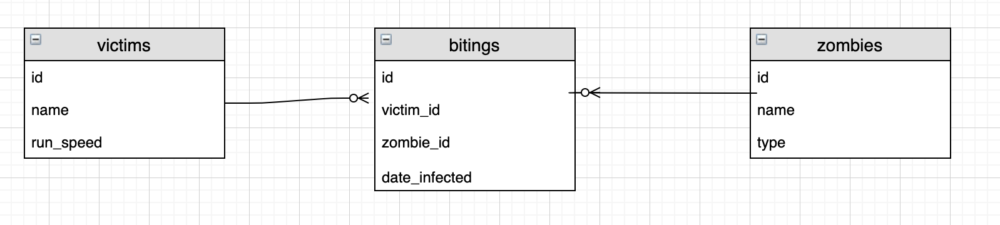

# Many To Many - Join Tables

So we've seen how we can get information from one table using a foreign key in a One to Many relationship.

We were able to get all tasks for a user by querying the tasks table and matching the `user_id` in that table to select tasks belonging to a specific user.

But what if we don't have that direct link between tables?

What if we have multiple one to many relationships? Or a Many to Many relationship?



In the representation above victims can have many bitings and zombies can have many bitings. But also victims can be bitten by many zombies. All 3 entities are connected in some way. The bitings table is the link between victims and zombies. (More on this tomorrow)

Setup for this lesson:

```bash
mkdir joins_many_to_many_zombies
cd joins_many_to_many_zombies
dropdb zombieland
createdb zombieland
```

Copy the zombies.sql into the joins_many_to_many_zombies directory.

```
psql -d zombieland -f zombies.sql
```

## Inner Joining Multiple Tables

In our zombies example, we might want to see a view that shows us a list of victims names, the zombie who bit them and the date they got infected. This will involve data from 3 tables.


Say for example, we wanted to view a list of all victims who have been bitten or even go another step and also see which zombie bit them.

We could do it, but we'd have to use multiple queries.

Not to panic! This is where Joins come in to play.

## Joins

When we join data, there's a few different ways we can approach it but the one thing that really matters is that there has to be some commonality between the tables. In our case, we have the bitings table as a link between the other two tables and we can use this to do some interesting things.

With joins, we think in terms of a 'right' table and a 'left' table. These can be any table you like, but it's worth being clear in your head which one you are talking about.

We'll decide what our left and right table will be. Let's say that the left table is `victims` and the right table is `bitings`.

## Let's make the magic happen

STEP ONE: Get all the columns from the left table (`victims`)
```sql
-- queries.sql
SELECT victims.* FROM victims;
```

After each step, run your `queries.sql` file with:
```bash
psql -d zombieland -f queries.sql
```

STEP TWO: Bring in the matches from the right table (`bitings`) given a common key to match on

```sql
-- queries.sql
SELECT victims.* FROM victims
INNER JOIN bitings
ON bitings.victim_id = victims.id;
```

So this will find, all the matching entries for the `victims` in the `bitings` table i.e. every victim that got bitten.

We can now think about this entire statement as being the entire left side now, that we want to bring in some more information to.

STEP THREE: Bring in the NEXT table you want to join on.

```sql
-- queries.sql
SELECT victims.* FROM victims
INNER JOIN bitings
ON bitings.victim_id = victims.id
INNER JOIN zombies
ON zombies.id = bitings.zombie_id;
```

At this point we *should* be seeing the exact same information as from the previous query.

We're still seeing the rows from victims, but if there's no errors our join has been successful.

STEP FOUR: Select the data from each table you are interested in.

```sql
-- queries.sql
SELECT victims.name, zombies.name, bitings.infected_on FROM victims
INNER JOIN bitings
ON bitings.victim_id = victims.id
INNER JOIN zombies
ON zombies.id = bitings.zombie_id;
```

## Additional Resources:

https://blog.codinghorror.com/a-visual-explanation-of-sql-joins/
