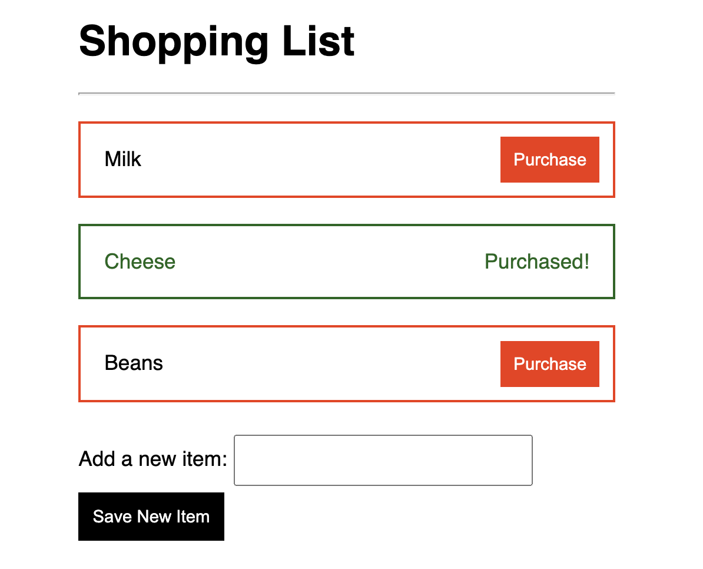
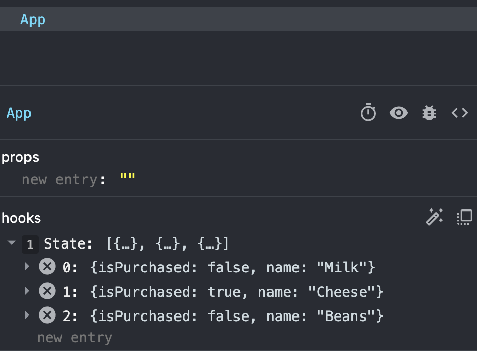

# React - State, Loops and Conditionals

**Duration: ??**

### Learning Objectives

- Be able to work with Reacts's chrome devtools
- Be able to work with Loops and Arrays in React
- Be able to use a simple form in React
- Be able to work with Conditionals in React
- Be able to work with forms and update the state


## Introduction

> Give out start point

Take a few moments to get the start point up and running. Remember, you will need to use `npm install` to install your node modules. Then do `npm start` to run our development server.

In this lesson, were going to build something slightly more complex. As we go through this application, we will use our dev tools in chrome to check our state is correct, so be sure to keep those open. (Command, option, i, then go to components)

## Shopping List



The application we are going to make is a shopping list that should: 

- Display a list of items
- Allow the user to add new items
- Allow the user to mark items as "purchased"

When we're planning our app in React, we can either start by thinking about the model (what data is stored) - or the view (what is displayed to the user.) Different people will approach problems in different ways, so experiment and find out what works best for you.

For now, we're going to start with the most basic approach of simply displaying a list of items, without worrying about marking items as complete, or adding items.

We know that we're going to need to track a list of items - an array - so let's start by declaring that on our componet. Let's put a couple of items in there to start off. Remember our use state takes an argument of an initial state. Lets hardcode our array there.

```js
import './App.css';
import React, {useState} from 'react'; // MODIFIED

function App() {

    const [items, setItems] = useState([
    { name: "Milk", isPurchased: false },
    { name: "Cheese", isPurchased: true },
    { name: "Beans", isPurchased: false },
  ]);  // ADDED

```

This would be a good time to check the dev tools to see our state corrrectly initialised in our app component.



Great! Now the next step would be rendering our items. 

You can see in the return we already have html tags for an `unordered list`. It would make sense for us to take each of our items in our shopping list, and create a `list item` tag for it. 

> Ask if students remember how to take an existing array and create a new array from it.

We will use the `map()` enumerator method!


```js
    const itemNodes = items.map((item) => {
        return(
            <li><span>{item.name}</span></li>
        )
    }) // ADDED

  return (
    <div className="App">
    //...
```

Then we will render our new array of nodes between the `ul` tags

```js
      <ul>
        {itemNodes} // ADDED
      </ul>
```

We should now see our items rendered to the page. However, if we check our console in chrome, we seem to have a warning. This is different from an error as it's not breaking our application in some way, but React is trying to help us out with this warning.

## Key prop in lists

React wants to be efficient. We know it uses a virtual DOM to know where each element is, therefore when that element changes, it only updates that one element on the actual DOM, instead of having to rerender the entire DOM.

When we make a list, however, React doesnt have any unique identifier for each list item. Therefore if something changes, it needs to re-render the whole list. Thats why this is only a warning. It wont break our application, but we could speed things up by giving a unique identifier. 

We should use unique identifiers for that particular object, possibly its databse ID or generate IDs with a library. For our purposes here, we are just going to use the index position that element is in the array. We then pass this to the list items key prop (more on props tomorrow. For now, you can look at it as an argument, just like a function would have).

```js
const itemNodes = items.map((item, index) => { //MODIFIED
    return(
        <li key={index}><span>{item.name}</span></li> // MODIFIED
    )
})
```
You will need to refresh the page, but our console warning should now be gone. 

## Adding a new Item

We want to be able to add a new item to our shopping list. For this, we are going to use a small form. When the form is submitted, we will call a function that will update our state with the new item. Lets start by rendering our form.

```js
    <div>
    //..

      <ul>
        {itemNodes}
      </ul>

      <form>        
        <label htmlFor="new-item">Add a new item:</label>   // ADDED
        <input id="new-item" type="text" />                 // ADDED
        <input type="submit" value="Save New Item" />       // ADDED
      </form>

    </div>
    //..
```

In order to capture the input from the user, we ideally want to know the value of the text input at all times. What we need, is to hold the value in the components state.

Lets initialise a new piece of state to hold onto whatever the user is typing in our text input. 

```js
const [items, setItems] //...
const [newItem, setNewItem] = useState(""); // ADDED
```

Then added a value attribute to our input to effectively bind it to our state variable. 

```js
<input id="new-item" type="text" value={newItem}/>
```

You'll notice that we cant type in the form at the moment. That is because the value will always be what the state is, and it is initially set as an empty string. 

We now need to create a function to change the state every time sometime changes in our text input. We will use the onChange event listener.


```js
<input id="new-item" type="text" value={newItem} onChange={handleItemInput}/>
```


Lets now make the function to update the state, tracking the forms input. Our even listener will pass into our callback an event object which gives us a lot of handy information about the event, including what the value is in the input at the time of the change! Lets grab the event object as its passed into our `handleItemInput` and drill down into it to grab our new item :


```js
 const itemNodes = items.map((item, index) => {
    //..
  })

  const handleItemInput = (event) => { // ADDED
    setNewItem(event.target.value)
  }
```


Always check your dev tools in chrome to see the state updating. Great! Its updating every time we change the text in the form!

The last step, is submitting the form to add our `newItem` into our list of `items` in state.

Add an `onSubmit` event listener to the form.

```js
      <form onSubmit={saveNewItem}> // ADDED
        //..
      </form>
```

Then we will create the function `saveNewItem`.

```js
  const handleItemInput = (event) => {
    setNewItem(event.target.value)
  }

  const saveNewItem = (event) => { // ADDED
    event.preventDefault();
  }
```


Remember by default, an HTML will make a post request when submitted, which will then refresh our page, and we will lose our state! That is where the event objects handy method `preventDefault` will help us. 


Now we need to think about pushing our new item into the items array in state. We dont want to do `items.push(newItem)`. This will be mutating state directly and potentially lead to unwanted bugs. We need to do 3 things.
1. Make a copy of our item array
2. Create a new object with the newItem as its name and push that into the copied array (By default we will say each item also starts isPurchased as false)
3. Use the provided function by useState to replace the previous items with our new updated copy


```js
 const saveNewItem = (event) => {
    event.preventDefault();
    const copyItems = [...items]
    copyItems.push({name: newItem, isPurchased: false})
    setItems(copyItems)
  }
```

We will finally set the newItem state back to an empty string, effectively clearing the form for the next item.

```js
 const saveNewItem = (event) => {
    event.preventDefault();
    const copyItems = [...items]
    copyItems.push({name: newItem, isPurchased: false})
    setItems(copyItems)
    setNewItem("")   // ADDED
  }
```


## Conditional Rendering

As you can see in our array or items in state, they have a key of `isPurchased` and a value of a boolean. Were going to use this to our advantage to conditionally render a new tag. 

We will use a ternary operator. This will have 3 parts.
1. A condition. (isPurchased equal to true?)
2. If true, execute the first part (show a span tag saying purchased)
3. If false, execute whats after the colon (show a button allowing an item to be purchased)

```js
<li key={index}>
  <span>{ item.name }</span>
  {item.isPurchased ? <span className="purchased">Purchased!</span> : <button>Purchase</button>} // ADDED
</li>
```

There's already some css in our App.css file, so our buttons should look nice!

Next we will conditionally render our `class` for our `li` tags to target them for specific css. A class for `purchased` items, and for `not-purchsed`.

In JSX, we use the word `className`. Remember we are working with JSX, and our JSX will be translated into JavaScript where `class` is a reserved keyword. So we use `className` instead.

We can use a ternary again to check our `isPurchased` key, and to add the class to that element depending on the boolean.

```js
<li key={index} className={item.isPurchased ? "purchased" : "not-purchased"}> // MODIFIED
  <span>{ item.name }</span>
  // ..
</li>
```

Looking great! Our classes have hooked up to some of the pre-set CSS already in our app.


## Update Purchased

Our last job is to let the user mark items as purchased.

We currently have a button conditionally rendering on items that `isPurchased` is false. Lets hook that up to a function so we can update that items `isPurchased` to true.

We first need an onClick event listener on the button. The function it calls when clicked will need to know which item we are currently updating. Lets pass it its index. (Remember, When our callback takes an argument in our event listeners, we need to wrap in an arrow function or it will trigger on creation of the button)

```js
<li> 
  //..
  <button onClick={() => purchaseItem(index)}>Purchase</button>} // MODIFIED
</li>
```

Our function will need to do a few things.
1. Copy our items in state. We don't want to mutate state directly
2. Use the index to find the item were updating
3. Copy the individual item too - again we don't want to mutate the original
4. Change the copy's `isPurchased` property to true.
5. Update the copy of the items with the updated item  
6. Set the copied items in state with the function provided by useState.

```js
const purchaseItem = (index) => {
  const copyItems = [...items]
  const updatedItem = {...copyItems[index]}
  updatedItem.isPurchased = true
  copyItems[index] = updatedItem
  setItems(copyItems)
}
```

And there we have it! Our state updates triggering a re-render. This will change the items CSS since the class has now changed, and the button has now disappeared.

## Recap


What do we use instead of `class` in JSX?
<details>
<summary>Answer</summary>
className
</details>

What happens when we update the state?
<details>
<summary>Answer</summary>
Our component re-renders, showing the changes on the page. Our application reacts to the changes in state.
</details>


What is the purpose of copying our items array when updating the state?
<details>
<summary>Answer</summary>
We do so to avoid mutating the state directly. It can cause unintended rendering issues and bugs.
</details>

What are some of the event listeners we used?
<details>
<summary>Answer</summary>
onSubmit, onClick
</details>

Why do we add the key prop in the li?
<details>
<summary>Answer</summary>
To get rid of the warning in the console. React wants to know the position of each element in a list to help with efficient re-rendering.
</details>


## Conclusion

We have now created a small, single component application to show how we can create and update the state. This will trigger re-renders on our page, hence showing changes. 

