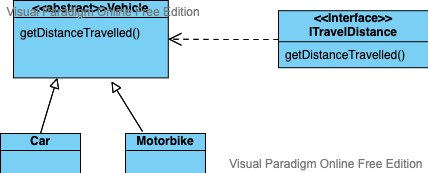

# Creating Our Own Interfaces

**Lesson Duration: 90 minutes**

### Learning Objectives

* Be able to create an interface
* Be able to implement an interface in a class
* Understand that a class can implement multiple interfaces

## Intro

In the previous lesson, we saw that an interface can be seen as a contract. We used an interface to interact with previously written code so that our code could work with that code by fulfilling the contract.

In this lesson we are going to concentrate on the opposite. That is, we are going to see how to create our own interfaces, so that objects have to conform to our contracts.

Sometimes we want a number of classes to implement similar type of functionality, but we do not want then to inherit from the same parent. In such a situation, classes can make a promise to implement certain methods - we call a promise like that an **Interface**.

An interface is written as a class, but it only contains descriptions of methods, not their implementation - like an abstract method in an abstract class.

Once an interface is defined, all classes that **implement** it promise to contain bodies of all the methods specified in the interface. 

### How to declare an interface

> Hand out start code. It has simple `Car` and `Bicycle` classes, and the tests for the getters. 
> Maybe ask students to draw class diagrams. 
 
> UML: Ask one of the students or instructor to draw the UML on whiteboard, leaving a lot of space for other classes we'll build during the lesson. This will be used throughout the class


Let's start with moving. At first we will make sure that the `Car`  promises to be able to move. It will implement an interface called `IMove`.

> UML: add `IMove` interface to your UML diagram on the board and connect it with `Car`


> A note on interface naming conventions
> 
> The naming convention we are going to use for our interfaces is an old one. We are going to put an 'I' before for the interface name. We are going to create an interface for a 'Mover', so our interface will be called `IMove`.
> Let's create a new interface called `IMove` in the main package.
> 
> NOTE: another naming convention that is commonly used is, rather than putting an 'I' at the start of the interface name, is to put the word 'able' at the end e.g. in our example the interface name would be `Moveable ` - a bit of a mouthful. This means that we can end up with weird looking words.


```
#IntelliJ
Create a new class called IMove.java and set its type to Interface from drop down. 
Right click > new > Java Class.
name class IMove and in drop down change to Interface.

```

This will give us the following:

```java
//IMove.java
public interface IMove {

}
```

Let's add a method to this interface called `move` that takes an `int distance` which does not return anything.

> UML: add `move(int)` to `IMove` interface


Note that we are not providing an implementation for the method. We are leaving this up to the classes which use the interface (just like with abstract methods in abstract classes)  

```java
//IMove.java
public interface IMove {
  public void move(int distance); // MODIFIED
}

```

> NOTE: later versions of Java do allow us to provide default implementations of methods which can be overriden in the classes using the interface. We won't be doing this on this course.

We use this interface with the **implements** keyword. So let's get our `Car` class to use this interface:

```java
//Car.java

public class Car implements IMove { // MODIFIED
  //...
}
```

Now our code won't compile. WHY?

> we now get the following error:
> Error:(1, 8) java: Car is not abstract and does not override abstract method move() in IMove

## Interface as a Contract

An interface forms a contract. Any class which implements an interface must implement **ALL** the methods in that interface.

If any are missing then we'll get a compiler error as the class is not fulfilling the contract. The contract doesn't say **HOW** these methods will be implemented, just that they **ARE** implemented.

Perhaps think of a Bank Account example. I may have accounts at several banks, but I expect that for each account, I should be able to pay-in money and withdraw money - that is the 'contract' I have with each bank. Each bank may do things differently, and to be honest, I don't care how, but they all do the things I expect them to do. We could say that all banks promise to implement an interface for paying-in and withdrawing money.

So what we are saying in our example is that the `Car` class, since it implements the `IMove` interface **MUST** have a method called `move(int distance)` which does not return anything.

In fact **ANY** class which implements the `IMove` interface must have a method called `move(int distance)` which does not return anything.

### How to implement an interface

So we now need to get our `Car` class to fulfil the contract i.e. we need to add a `move(int distance)` method, which does not return anything.

> UML: add `move(int)` to `Car`


We'll write the test first:

```java
//CarTest.java

	@Test
	public void canMove() { // NEW TEST
	    car.move(10);
	    assertEquals(10, car.getOdometerReading());
	}

```

And then implement the method:

```java
//Car.java

public class Car implements IMove {

  //...

    public void move(int distance){
        this.odomoterReading += distance;
    }
}

```

### Interface becomes even more useful when many classes implement it

Let's create another class that will also implement the `IMove` interface: a `Bicycle`.

> Give students 5 minutes to complete this task:
> 
> make the `Bicycle` class also implement `IMove` interface and all functions that it promises. Write your tests first.

> UML: connect `IMove` with `Bicycle`. Add `move(int)` to `Bicycle`


Solution:

```java
//BicycleTest.java

public class BicycleTest {

    @Test
    public void canMove() { //NEW TEST
        bicycle.move(10);
        assertEquals(10, bicycle.getDistanceTravelled());
    }

}
```

```java
//Bicycle.java

public class Bicycle implements IMove {

    public void move(int distance){ // ADDED
        this.distanceTravelled += distance;
    }
}
```

> Note: in this class, all the implementations of `move()`, etc will be very similar, but thanks to separating them we are able to add to them class-specific behaviours. For example, the `Car` implementation of `move()` could include all the steps involved e.g. engine firing, crank turning, gears engaging etc. 

## Implementing Multiple Interfaces

### Unique advantage of interfaces

Did you notice that what we've built up until now could have been just as well implemented with inheritance? **Theoretically `Car` and `Bicycle` could have inherited the moving bevaviour from the same parent class**. This is where unique advantage of interfaces comes into play: a class can implement multiple interfaces at the same time.

- When we use inheritance, our **class can only inherit from ONE superclass**. 
- When we use interfaces, our **class can implement as many interfaces as it wants**.

### Interface segregation

Let's consider a following task:

> UML: try to use your UML diagrams to illustrate below:

Just like we had our `Car` and `Bicycle` promise that they will implement a `move(int distance)` method, let's have our `Car` promise that it will implement a `start()` method.

There are two bad ways to do it: 

1. We could create a parent class, `Vehicle`, which both `Car` and `Bicycle` inherit from and add a `start()` method on the `Vehicle` parent class
2. We could add a `start()` method to the `IMove` interface,

> Can you think of why these methods are not good solutions?

Neither of these really makes much sense.

Why? If we choose option (1) this would mean that every class which inherits from`Vehicle` would have a `start` method, whether it likes it or not.
On the other hand, if we go with option (2) then *EVERY* class which implements `IMove`, like our `Bicycle` would now also need to have a `start()` method. One thing about using inheritance or interfaces is that we shouldn't force methods onto classes that they don't need.

In real life, it should be possible to be a bicycle without having to be able to start.

When creating an interface we should think about the classes which are going to implement it. We might add a lot of methods to an interface, but we need to ask ourselves "Do we really want to have to implement every method of this interface in every class that implements it?". Keeping things simple is often a good idea.


### Implementing another interface

Let's instead add a new interface `IStart` which will promise that classes which implement it will have a `start()` method. This interface will be implemented by `Car` but not by `Bicycle`.

> Give students 5-ish minutes to complete this task:
 
> UML: as you describe below, add these elements to UML on whiteboard

Create two interfaces: a `IStart` (promising `start()`) and `IStop` (promising `stop()`) interfaces.

`Car` (but not `Bicycle`) should implement `IStart`.

`Car` and `Bicycle` should both implement `IStop`

 Implement methods these interfaces promise, so that your code compiles.

Write your tests first.

> UML: by now you should have new interfaces: `IStart` and `IStop`. They are connected with `Car`, and `Bicyle` where appropriate. You also added `start()` and `stop()` where appropriate.


As mentioned above it is a good practice, to have smaller highly cohesive interfaces rather than larger less specific ones.

```java
//IStart.java
public interface IStart {
    public String start();
}

//IStop.java

public interface IStop {
    public String stop();
}


```

```java
//CarTest.java

    @Test
    public void canStart() { // NEW TEST
        assertEquals("Switch on the ignition", car.start());
    }

    @Test
    public void canStop() { // NEW TEST
        assertEquals("Ease off the accelerator, apply the brake", car.stop());
    }

    
//BicycleTest.java
    @Test
    public void canStop() { // NEW TEST
        assertEquals("Stop pedalling, apply the brakes", bicycle.stop());
    }
    
```

```java
//Car.java

public class Car implements IMove, IStart, IStop { // AMENDED

    // AS BEFORE 

    public String start(){ // ADDED
        return "Switch on the ignition";
    }

    public String stop() { // ADDED 
        return "Ease off the accelerator, apply the brake";
    }
    
}

//Cyclist.java
public class Bicycle implements IMove, IStop {

    public String stop () { // ADDED 
        return "Stop pedalling, apply the brakes";
    }
}

```

### SOLID: Interface segregation

Notice what we've done - we separated moving our objects into three small interfaces `IStart`, `IMove` and `IStart`. This way classes that want to be able to start, promise that they will be able to start. But classes who do not want to start, do not promise starting.

The Interface Segregation rules basically states that classes should not implement methods that they do not need.

> UML: you can use UML to describe the below

1. **When an interface is large and complicated, try to separate it into smaller interfaces**:
	
	> Just explain, or show in code, but ask students to NOT code along and show this in IntelliJ:

	Imagine we did not have `IMove`, `IStart` and `IMove` but instead we had just one large generic interface `ICanDrive`. `ICanDrive` would promise `stop()`, `start()` and `move()`

	Now imagine each of `Car`, and `Bicycle` implemented that interface. To make the compiler happy, you'd probably need to implement the required methods and have them do nothing interesting (since normal Bicycles do not have an engine to start).  

Which takes us to the second important part of interface segregation:

2. **Classes should not implement interfaces that are not needed or are too generic**, because you will have to write empty methods to satisfy these interfaces:
	
So with Interface Segregation we need to ensure that no class should be forced to depend on methods it does not use. We should split interfaces that are very large into smaller and more specific ones so that clients will only have to know about the methods that are of interest to them.

When creating an interface we should think about the classes which are going to implement it. We might add a lot of methods, but we need to ask ourselves "Do we want to have to implement every method in our class?"

> Instructors: Write Interface Segregation on the board under our SOLID header. 

## Abstract classes and superclasses can implement interfaces

### Superclasses implementing an interface 

One thing to note is that abstract classes and superclasses can also implement interfaces.

> UML: you can use UML to describe the below



Suppose we have a superclass `Vehicle` which has two subclasses, `Car` and `Motorbike`.
If we create an interface `ITravelDistance` which promises a method `getDistanceTravelled()` this interface can be implemented by the `Vehicle` class. This means that `Vehicle`needs to implement the `getDistanceTravelled()` method, but it also means that all subclasses of `Vehicle` can be referred to using `ITravelDistance` as type (eg. `Car`, `Motorbike`), because they would also inherit the implementation of that interface.

### Abstract classes implementing an interface

> UML: this could be best explained with a simple class diagram

Abstract classes can also implement interfaces. Let's imaging an abstract class `Shape` which has two non abstract children `Square` and `Circle`. Let's have `Shape` implement an interface `IHasArea` which promises a method `double area()`.

There are two options whenever an abstract class implements an interface:

1. Provide a full implementation of the `area()` method in the abstract class. That implementation will cascade to all subclasses. 

	This is not the best solution for the `Shape`, because each shape has a different formula for its area, hence it's hard to come up with a default formula for the area.

2. Make the `area()` method and abstract inside of `Shape` class and provide full implementations of it in each of the sub-classes (`Square`, `Circle`).


### Interfaces inheriting other Interfaces

> Optional Section: Feel free to skip this section during the class.

Java classes can only inherit one super class. But fortunately interfaces are not exactly Java classes, so as an exception they can inherit from many other interfaces.

Let's imagine two scenarios:

> UML: you can use UML to describe the below


1. Interface extending another interface

	> in IntelliJ Create a new Java interface called `IDrive ` and write:
	
```java
	public interface IDrive extends IMove {
	    public void steer();
	}
```

	A class that implements interface `IDrive` needs to have all methods promised by `IDrive` and its parent `IMove`, so both `steer()` and `move(int distance)`.

2. Interface combining multiple other interfaces


	> in IntelliJ Create a new Java interface called `ICanDrive` and write:

```java
	public interface ICanDrive extends IStart, IStop, IMove {
	}
```

	Now if we'd like some class to implement all 3 interfaces (`IStart`, `IStop`, `IMove`) we could simply have that class implement `ICanDrive`.

3. A combination of both of these approaches (where you both add new methods and combine many other interfaces).

As we mentioned above in the SOLID section. It is good to separate interfaces into small ones which promise just a few methods each.

# Recap

* An interface is a bit like a class except that it only contains descriptions of methods, not their full implementations.

* Interfaces are implemented by classes and form a contract in that, if a class implements an interface, then it must implement *ALL* the methods declared by that interface.

* Classes can implement multiple interfaces

* It is better to implement multiple, smaller interfaces, than larger less specific ones.
