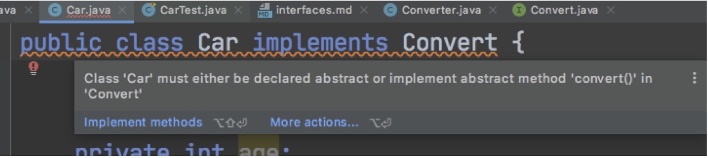

# Using Interfaces

## Learning Objectives 

By the end of this lesson you'll be able to:

- Use / implement an interface that's already been written
- Understand the benefits of using an interface VS using inheritance / abstract class.
- Understand the benefit of the interfaces "contract"
- Understand the benefit of the interfaces giving multiple types for objects that use it (polymorphisim)


## The Problem

You've been given a library (that's some code that helps you do something that wasn't written by you). This library allows you to convert the data in your class to some sort of simple string format.

A simple example is that if your class has properties `name` and `age`, then the library when used will give you a string like

```
"Car name Tesla."
```

> Notice that the library only outputs the car's name in a string.

To use the library you need to pass the car object you want to convert into the library's static method `Converter.process(Car)`.

Now create a class called `Car`, then in a test create an instance of it, and pass it to the library `Converter.process()`.

> Our converter library `Converter.process()` is a static method so we don't need to create any
instances of it to be able to use it

```java
// Car.java

public class Car {

  private String name;
  private int age;

  public Car(String name, int age) {
    this.name = name;
    this.age = age;
  }
}
```

```java
// CarTest.java

public class CarTest {

	@Test
	public void canConvertCar(){
		// Given we have a car
		Car car = new Car("Tesla", 3);

		// When we pass it to the converter
		String message = Converter.process(car);
		// Then we should see some converted string
		assertEquals("Car data", message);
	}
}
```

Notice as soon as we write that test, there's a compiler error on the `.process(car)` method.

Basically, the process method doesn't take objects of type `Car`. We cannot fix that by editing the
`process()` method **since this is a library written by someone else**. So we need to make a change
on our side.

We're going to demonstrate how to fix this two different ways without changing the code of the library:

- **Inheritance** - we'll use inheritance to make our car compatible with the `process()` method.
- **Interface Implementation** - We'll use an interface to make our car compatible with the `process()`
method.

Both of these different approaches will give the same result, the point in this lesson is to explore and understand the differences and benefits of each.

## Solution: Inheritance

To pass our car object into our library method so that it can be processed and converted correctly we need to make our `Car` class inherit (extend) from a parent class, `Vehicle`. 

This means that we can treat an instance of a `Car` class as being an instance of the `Vehicle` class, and so can pass it in. 

> We say that we are making our car object in this example _polymorphic_ with Vehicle (more about this in a later lesson)

Edit your car class now

```java
// Car.java

public class Car extends Vehicle { // changed
  ...
}
```

As soon as `Car` becomes a sub-class of `Vehicle` everything seems to compile ok. Try running the test now.

Since the car object is now polymorphic between `Vehicle` and `Car` the `process()` method accepts it.

Oh no! We've a failure when running that first test

```
org.junit.ComparisonFailure:
Expected :Car data
Actual :Vehicle car conversion data here
```

We expected the result of the conversion with our car object to be the string `Car` data , but it is `Vehicle` car conversion data here.

Let's break down what's happened. Our library has told us that if we wish to use it, we need to inherit from `Vehicle`. However `Vehicle` has an implementation of the method that our library is calling on our class.

The method it's using doesn't exist on the sub-class `Car` but it does exist on the super-class `Vehicle`. Since `Vehicle` is part of our library we can't touch the code for that either, what should we do?

> Ask the class for suggestions

A sensible suggestion is to **Override** the method that the super-class provides. Doing it this way, and in a scenario where we've **not been explicitly told what the method is** can be quite tricky. But after some digging around we find out that we need to override the `String convert()`.

Edit the `Car` class to override the `convert()` method.

```java
//Car.java

public String convert(){ //Added
	return "Car data";
}
```

Running the test we can see that the override is now being used, and the test passes. Fantastic.

### Overview of the inheritance solution

Since `process(Car)` wouldn't accept our object we had to inherit `Vehicle`. This made it polymorphic with `Vehicle`. `Vehicle` has it's own implementation of the `convert` method which our library needs, and that's the one that gets used unless we override it in our class.

- This approach works ✅
- The test passes and we achieved what we wanted to do ✅
- This approach is quite good if we don't want to change the super-class implementation ✅
- It was hard to know which method our class needed to override ❌
- Our `Car` class has now inherited everything from `Vehicle`, but we don't want or need all that stuff.
What's all the code in `Vehicle` doing anyway? We can't be sure. ❌
- Forcing our class(es) to be part of an inheritance chain is a very "one size fits all" messy approach ❌

## Solution: Interfaces

> !! Before starting, delete the `convert` method from the `Car` class, as well as the `extends Vehicle` from it.

Imagine that the author of the library states the following in their docs:

```
process(Convert). To use the process method, implement the Convert interface.
```

To do that, go to `Car` and "implement" the interface using the `implements` keyword as follows:

```java
// Car.java
public class Car implements Convert { // updated
  ...
}
```

This is how we _use_ an interface. Notice that as soon as we do that, we'll get a compiler error visible in IntelliJ with red underline for the whole line.



This is happening because when an interface is implemented it comes with a kind of contract. The contract is with the compiler and it's designed to **force you to implement methods that have been stated in the interface's body**.

This is what an interface is for: It allows a developer to create a contract with another developer who's using their code to say: 

The author of the library is essentially saying **"If you want to do this, you NEED to implement these methods"**.

In our case we need to implement a method with the signature `String convert()` and our code will not compile until we do exactly that.

```java
// Car.java
public String convert() {
    return "Car data";
}
```

> Yes. This is the same method that we chose to create an override for in the previous example. This is a different way of getting to that point

Doing this overrides the `convert()` method as before, but the difference is that we're being forced to match the method signature. This is good because it's keeping us right.

Now run the test and watch it pass.

We've just seen how to use an interface.


### Interface as a Type

By modifying our `Car` class to implement the `Convert` interface we can now pass a `Car` object to the `process` method in our `Converter` class.

But why does this work?

A class implementing an interface also takes on the type of that interface. This means that once a Java class implements a Java interface you can use an instance of that class as an instance of that interface. In our example we can now treat our `Car` class as an instance of our `Converter` class.
 
```java
//Converter.java

public static String process(Convert convert){
    return convert.convert();
}

```

Note that when we use an interface as a type (eg. `Convert`), we can only access those methods which are listed as part of the interface. If a class which implements the interface has other methods that are not a part of that interface (eg. if our `Car` class had a method called `getDistanceTravelled()`), then we cannot access these methods when simply using the type of the interface.

We can now treat a `Car` as being both a `Car` and a `Convert` object. Thus we can say that our `Car` can have __many types__ or  __many forms__. This is what we mean by the term *polymorphism* - one of the "Four Pillars" of Object Oriented Programming

### Overview of the interface solution

Since `process(Car`) wouldn't accept our object we had to implement the `Convert` interface. This made it polymorphic with `Convert`. `Convert` does not have it's own implementation of the `convert` method which our library needs. However using the interface forced us to implement our own. Unlike when we used inheritance we NEED to implement the method, this way when the object has that method called on it, it's guaranteed to do _something_.

- This approach works ✅
- The test passes, and we achieved what we wanted to do ✅
- This approach is good if we want to provide our own implementation of the method ✅
- It was easy to know which method our class needed to override ✅
- Our `Car` class didn't need to inherit an entire tree of methods and properties to obtain access to just one behavior. ✅
- Using the interface is a more scalable approach - we can select which classes use an individual ability or action, rather than an entire tree of actions ✅

## What we've learned

- In a lot of cases we don't have the ability to edit someone else's code so we need a way of working with their solution
- This can be done with inheritance and an override - but this isn't a scalable solution
- It can be done by using or implementing an interface.
	- We've learned how to implement (make use of) an interface that's already written for us
	- An interface provides a contract when implemented as well as giving our objects the ability to be of that type as well as their primary type (in our case our `car` object is of type `Car` and of type `Convert` )
- When a class implements an interface it takes on the type of that interface and so an instance of the class can also be seen as an instance of the interface. This is known as Polymorphism 


