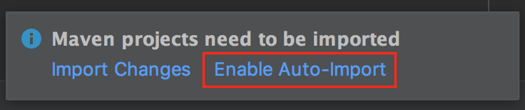

# Intro to Spring and Spring Boot

**Lesson Duration: 30 - 45 minutes**

### Learning Objectives

- Understand what Spring and Spring Boot are used for
- Know some of the things you can do with Spring
- Be able to select some dependencies and generate a new Spring Boot project

## Introduction

Spring is a framework for **back-end** web application development. It can be viewed as an "umbrella" framework, as it allows you to easily make use of many different technologies across a standard of Java technologies.

**Why are we learning this?**
Spring is widely used, it is the go to framework in Java for creating web applications.

**What problem are we trying to solve?**
When we are building back end applications in Java, we often want to do similar tasks that require a lot of code, such as building web servers, writing controllers, defining routes and more. Because developers often want to do these things in the same way, spring has been written in such a way that helps programmers achieve these tasks while writing as little code as possible.

By the end of this week you will be able to use Java with Spring to:

- Easily create back-end web applications that persist objects to databases
- Use RESTful routes to GET POST PUT and DELETE those objects from the database
- Create a RESTful API with additional custom routes

### What is Spring?

Spring is a framework for back-end web application development. It can be viewed as an "umbrella" framework, as it allows you to easily make use of many different technologies across a standard of Java technologies.

**Spring is not just one library that we bring into our code to add features** Spring gives us one or more libraries to choose from


Visit [Spring's project list](https://spring.io/projects) to view a list of some of the things which have been built using Spring. Spring projects can be installed as dependencies and are used to add additional functionality to our own projects.


> Objective: Get students excited about the many different things you can do with Spring!

Previously when building applications we have been building a lot of this functionality manually:
1. We have been mapping our objects to databases using SQL statements with the objects properties defined as columns.
2. We have been creating controllers that define a set of RESTful routes.
3. We have been writing methods that read/write to databases to create CRUD functionality.

These things are all going to be done for us by using these spring projects. We are going to be using the following the Spring projects:

- **Java Persistence API with Spring Data** for reading/writing to a database to persist objects. We will no longer have to manually map our objects properties to database tables, or write the methods that implement the CRUD functionality. This uses  **Postgres SQL** under the hood.
- **Spring Boot Web Framework** to help us create controllers.

We will get all of the above functionality out of the box.

#### Spring Boot - an all in one

Spring Boot is an **all in one** project under the spring umbrella that allows us to easily build applications that have:

* Some web / REST controllers.
* Some database interactions.
* Some configuration.

In most cases, when we say a "Spring" project, it's probably techically using Spring Boot. In most cases, we will actually be talking about Spring Boot. More on boot here: [https://docs.spring.io/spring-boot/docs/current-SNAPSHOT/reference/html/index.html](https://docs.spring.io/spring-boot/docs/current-SNAPSHOT/reference/html/index.html)

### Using Spring Boot "initializr" to Initialise a Project

Spring Boot Initializr is a starter tool for beginning Spring based projects. As Spring is huge, Spring Boot Initializr allows us to generate the boilerplate code for a project, with any dependencies we choose already installed. In industry, the Spring Boot Initializr (some times referred to as spring generator), is widely used to bootstrap projects.

- Go to [https://start.spring.io/](https://start.spring.io/)
- Ensure 'Maven Project' is selected for Project, and that 'Java' is selected for Language.
- Select Spring Boot version 2.7.5
- For Project Metadata:
    - In the Group field enter  - 'com.codeclan.example'
    - In the Artifact field enter - 'pirateservice'
- Select Jar as the compilation output.
- For the Java Version we recommend that you select version 1.8(8) for now.
- Click the ADD button next to where it says 'Dependencies'.
    - Search and add: **Spring Web**, **Spring Boot DevTools**, **Spring Data JPA**, **PostgresSQL Driver**
- Click "Generate Project" and the zip will be downloaded.

The dependencies we have just installed for this project are:

- **Spring Web** - allows us to do RESTful routes and create controllers
- **Spring Boot DevTools** - makes building spring a little easier with things like automatic reloading
- Spring Data JPA - **Java Persistence API** Gives us the power to use Java to "persist" our objects to the database using Hibernate, which we will learn more about shortly.
- **Postgres SQL Driver** allows Java programs to connect to a PostgreSQL database using standard, database independent Java code.

The .zip file given to us by Spring Boot Initializr contains a pom.xml file, and some very simple boiler plate Java code.

### pom.xml + Maven

Each dependency we chose on the "initilizr" is put into the `pom.xml` for us. This is why Spring Boot "initilizr" is so useful. `pom.xml` describes the dependencies by listing libraries we want to download and install to build and run that project.

Maven is a build system for Java, just like Gradle. Build systems like Maven and Gradle are responsible for compiling or "building" multiple source files of code into a single application. Keep in mind that Java is a compiled language, meaning that the `.java` files are compiled into a machine language. Build systems, like Maven make the act of building multiple files and bringing in dependencies significantly easier.

Our `pom.xml` is describing to Maven what dependencies we want.

### IntelliJ + Maven

IntelliJ can open up Maven based projects. Luckily this is what was generated and given to us by the Spring Boot Initializr online tool.

Unzip the file to somewhere in coursework and open the folder containing the `pom.xml` with IntelliJ. IntelliJ will ask if you want to enable the automatic import of Maven projects and you can select 'Enable Auto-Import'.



*Screenshot of Enable Auto-import Window*

### Point to the Database

As part of this application, we will want to read and write objects we create to the database. To do this, we need to tell Spring where the Database is.

#### application.properties

When using spring, a lot of the applications "static configuration" - this means config settings we will not want to change while our app' runs - will need to be set in one common place where Spring can find it. This is what the `application.properties` file is for.

Find the initially empty `application.properties` file in the `resources` directory - src / main / resources - and paste in the following:

```
# Datasource and Postgres settings
spring.datasource.url=jdbc:postgresql://localhost:5432/pirates
spring.datasource.username=user
spring.datasource.password=
spring.jpa.hibernate.ddl-auto=update
spring.jpa.database-platform=org.hibernate.dialect.PostgreSQL9Dialect
spring.jpa.properties.hibernate.enable_lazy_load_no_trans=true
```
NB: If you have issues with the username and password when we try to run this later, try:
    username=postgres
    password=postgres

> Objective: Let's discuss some of these settings we've just pasted in...

#### DDL-auto setting

`spring.jpa.hibernate.ddl-auto = update` is a setting that tells Hibernate + Spring that when we make changes to the database schema (the structure), the changes should be applied to the database.

There are some other value options for various situations. They are:

- **validate**: validate the schema, makes no changes to the database.
- **update**: update the schema.
- **create**: creates the schema, destroying previous data.
- **create-drop**: drop the schema when the application is stopped, then re-create the schema when it's started again.

#### Enable Lazy Load

`spring.jpa.properties.hibernate.enable_lazy_load_no_trans=true` allows the option to do "lazy loading". This simply means that when querying data on models with relationships, Hibernate will not bring back every single element for both sides of the relationship. This is good for not bringing back unnecessary data.

### Making sure the database is clean and ready to use
At this point it's unlikely that you will have the Postgres database
Pirates created.
Open a new terminal. (Does not matter where) and type in
```createdb pirates```
If you get a message saying pirates database already exists then in Postico go to the database
right click on it and say delete to remove it so that you are starting from a fresh start point.
Then go back to the terminal and type in ```createdb pirates``` to create a fresh Database.
Note that this is only needed for the purposes of lessons ordinarily you would use the same Database and not delete it every time.


### Running Spring Applications

Even though our application does nothing at the moment, we can run this bare-bones application. Find `PirateserviceApplication.java` in src / main / java / com / example / pirateservice.

The class `PirateserviceApplication` is special as it contains the `main()` method. Note that this was already written for us, and that it's already been populated with some code:

```java
SpringApplication.run(PirateserviceApplication.class, args);
```

This tells Spring to start, but does nothing else. For the most part that's all we really need in here. This is because of the way Spring works, we launch it, and then ask it to find our code in other ways.

Run this. Everything has worked if the application runs and doesn't exit then displays the following at the end of a lot of logging output:

```
Tomcat started on port(s): 8080 (http) with context path ...
Started PirateserviceApplication in 5.663 seconds (JVM running for 6.615)
```

We are now ready to start building a Spring Application. This will be done over the next few lessons.

## Recap

- Spring is a framework for building large and small web application allowing you to make use of potentially many different applications
- Spring Boot allows us to start Spring applications easily. We choose what we want to build, and this start generator makes a project with a `pom.xml` (maven dependencies file) which is pre-filled with the list of dependencies. It is used much like generating a new project in IntelliJ.

### Useful links:

* [https://spring.io/learn](https://spring.io/learn)
* [https://start.spring.io/](https://start.spring.io/)
* [https://www.baeldung.com/spring-boot](https://www.baeldung.com/spring-boot)


# Next Lesson
[Annotating Classes](../2_annotating_class/annotating_class.md)
